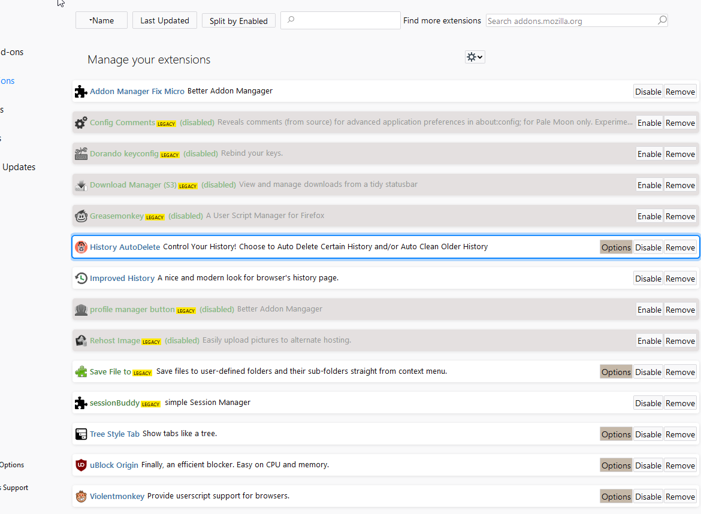
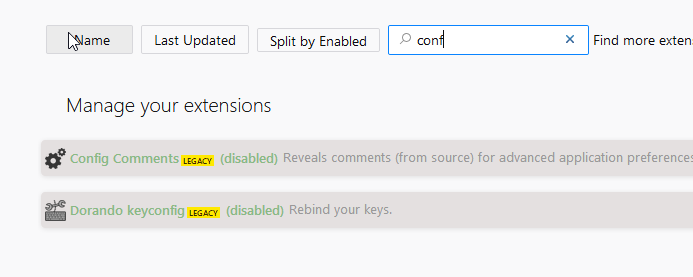

# addon_manager_fix_micro
better addon manager firefox quantum beta, nightly , unbranded

adds back buttons to sort your extensions !

slim style 

color coding: blue label = webextension addon ; green label = classic/legacy addon 

added filter textbox, type to find your addons

base on https://github.com/srazzano/Addon_Manager_Fix
